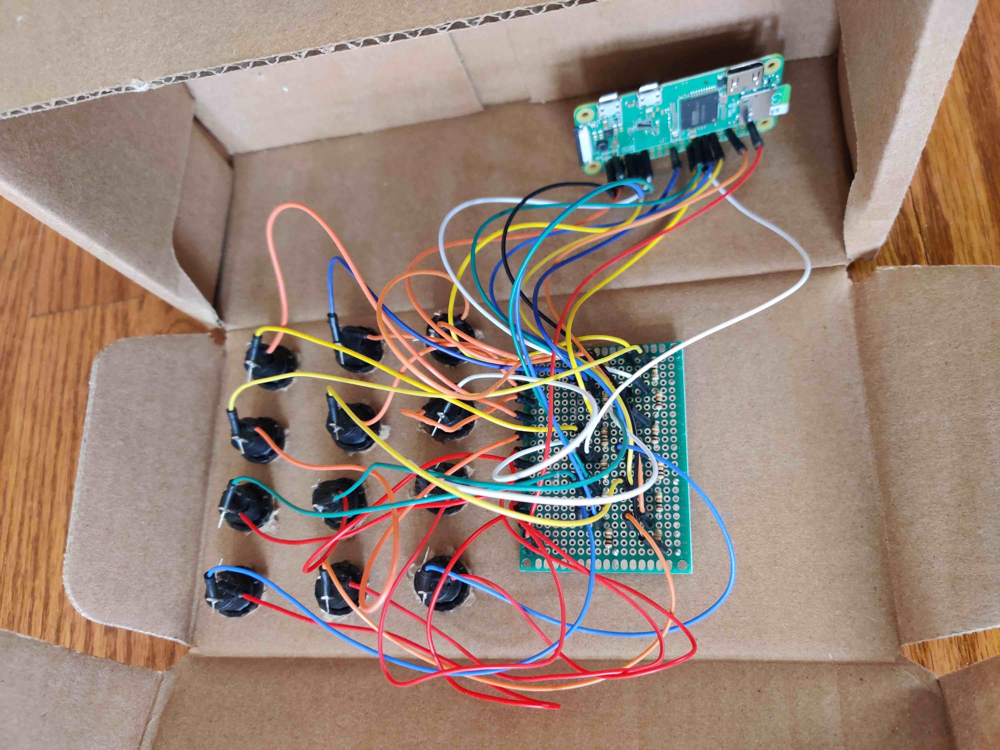

# cactuspi-control
A raspberry pi controller service manages buttons to send curl requests to cactuspi-server.

This project is one of the multiple services of CactusPi project. For more details on this project, please read https://codeburst.io/creating-a-nodejs-led-matrix-display-framework-with-raspberry-pi-955509baea8c.

You may also use this service to trigger your own set of endpoints by hooking up the buttons you setup on your raspberry pi. The GPIO pins can be easily configured in the `config.json`.

Before running this service, make sure you have already solder buttons to your raspberry pi.

Buttons soldered to raspberry pi:


Cardboard case buttons:


You can also use breadboard for prototyping:


## Instructions ##
1. Download cactuspi-control.
```
git clone https://github.com/dannielum/cactuspi-control.git
cd cactuspi-control
npm i
```
2. Create config.json.
```
cd cactuspi-control
cp config.json.sample config.json
```
3. Open config.json and set the `host` and `port` of your endpoints.
4. Configure the GPIO pins. For example, if you want the button press that triggers `GPIO-7` to curl to `localhost:8081/hello/world`. Your `config.json` will look like this:
```
{
  "host": "localhost",
  "port": 8081,
  "buttons": {
    "P1-7": "hello/world",
    "P1-11": "",
    "P1-13": "",
    "P1-15": "",
    "P1-29": "",
    "P1-31": "",
    "P1-33": "",
    "P1-35": "",
    "P1-37": "",
    "P1-16": "",
    "P1-18": "",
    "P1-22": "",
    "P1-36": ""
  }
}
```
5. Run
```
sudo npm start
```
Note: You might need to run it with sudo.
